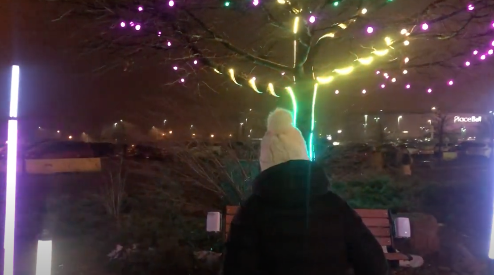

# INSERER UNE VIDÉO DANS UN FICHIER .MD

Pour insérer une vidéo sans être contraint par la taille du fichier, il s'agit d'abord de publier la vidéo sur votre chaîne YouTube.

Puis, en utilisant la syntaxe ci-bas, vous intégrerez miniature générée par YouTube sur laquelle il sera possible de cliquer. Cela mènera directement à la vidéo, dans YouTube. La vidéo n'est pas stockée dans votre *repository*, mais cette stratégie vous permet de faire visionner la vidéo facilement.

Syntaxe :

L'ID de la vidéo, c'est ce qui apparait après *watch?v=* dans l'URL.

Voici l'apparence que cela prendra :

### Voici l'oeuvre Prosperity II en action (Samuel St-Aubin, BIAN, février 2022)

Dans le cas d'une vidéo pour laquelle aucune miniature ne serait générée (par ex. : YouTube Short), il est possible d'intégrer une capture d'écran de la vidéo et d'intégrer l'hyperlien vers votre vidéo à cette image en reprenant une syntaxe de ce type :

Voir le *raw* de ce fichier .md pour l'exemple de syntaxe.

> Oeuvre Lumasol (exposition Mycélium, TIM 2023) en fonction, soir du 23 mars 2023, vidéo par Karine L'Ecuyer

