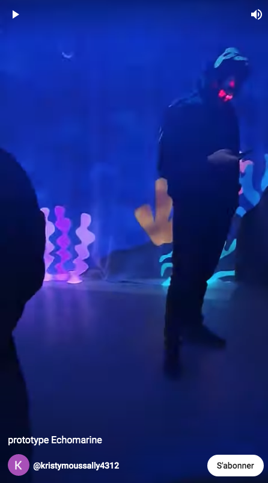

Bonjour Kristy,

Voici ce que je te recommande, puisque les Youtube shorts ne génèrent pas d'icones.

Intègre une capture d'écran de la vidéo (donc une image) et inscris la syntaxe d'un hyperlien.

Ceci voudrait donc dire (regarde en raw, tu verras la syntaxe)

(https://www.youtube.com/shorts/kGjfmbS7kY4)
