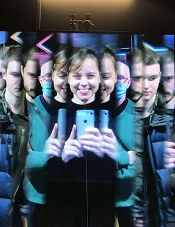

# Karine L'Ecuyer

Photo prise devant l'oeuvre *Bilateral Time Slicer* de Rafael Lozano-Hemmer, BIAN, janvier 2023

## Intérêts dans le domaine du multimédia
J'aime particulièrement l'art numérique, notamment les oeuvres qui sont à la fois immersives et interactives comme en produit l'artiste Rafael Lozano-Hemmer. Voici d'ailleurs l'une de ses oeuvres, *Champ d'atmosphonie*, lors de l'exposition *Cercania* à Arsenal art contemporain en 2020.

## Ce que j'aime d'enseigner la muséologie en TIM
Permettre aux étudiant.e.s d'aiguiser leur regard sur les oeuvres et dispositifs multimédias en exposition et qu'ils et elles voient ainsi tous les petits éléments à soigner dans la mise en exposition pour une meilleure expérience des visiteurs. J'adore retrouver les étudiant.e.s en 3e année et vivre leur création de fin d'études. :heart: 
